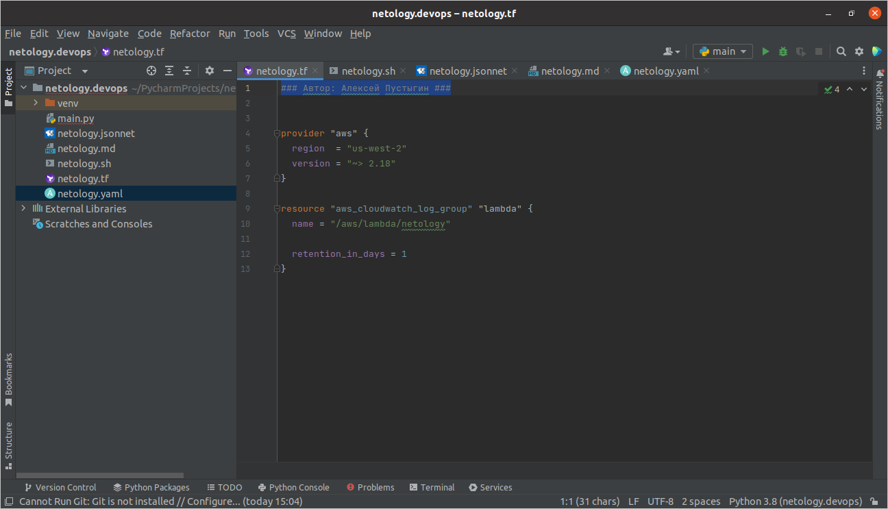
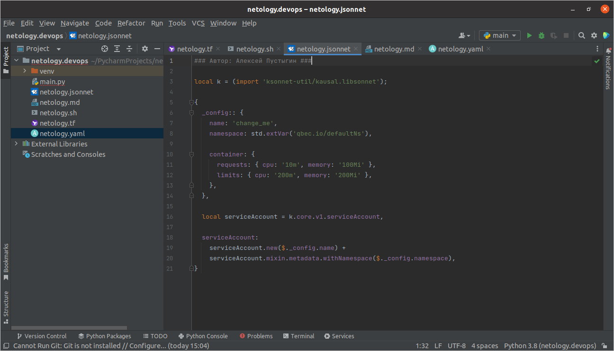

*Автор: Алексей Пустыгин*

[tf]: https://drive.google.com/file/d/1szOHNqilmNLzdY6XCGrTLxpysMfB6Lcf/view?usp=sharing
[sh]: https://drive.google.com/file/d/15ow9QhXAkWIGQ1pEa8yY36NBnYsr0FL3/view?usp=sharing
[md]: https://drive.google.com/file/d/1B3yfgXt8Z0prU1sYov7GP1-yiuKRVlMr/view?usp=sharing
[Yaml]: https://drive.google.com/file/d/1st-cEUxti0xzQRPmdz5VACvRdW8bph0G/view?usp=sharing
[Jsonnet]: https://drive.google.com/file/d/1WIF2e3AVUlu8pqOpFdZuQ7YA5Bk9s-Hj/view?usp=sharing 

# Домашнее задание к занятию «1.1. Введение в DevOps»

---
## Задание 1
>+ [Terraform][tf]
>+ [Bash][sh]
>+ [Markdown][md]
>+ [Yaml][Yaml]
>+ [Jsonnet][Jsonnet]

---
## Задание 2 - Описание жизненного цикла задачи (разработки нового функционала)

> 1. Обсуждаем с заказчиком новый функционал
> 2. Обсуждаем с командой что и как должно выглядеть/работать  
> 3. Кодирование/разработка ПО  
> 4. Тестирование 
> 5. Внедрение 

---
## Задание 1 img
+ Terraform 
+ Bash 
+ Markdown 
+ Yaml 
+ Jsonnet 

*Конец Файла*
