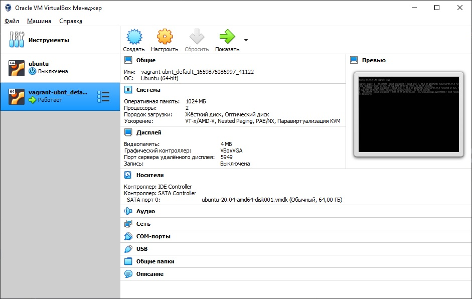
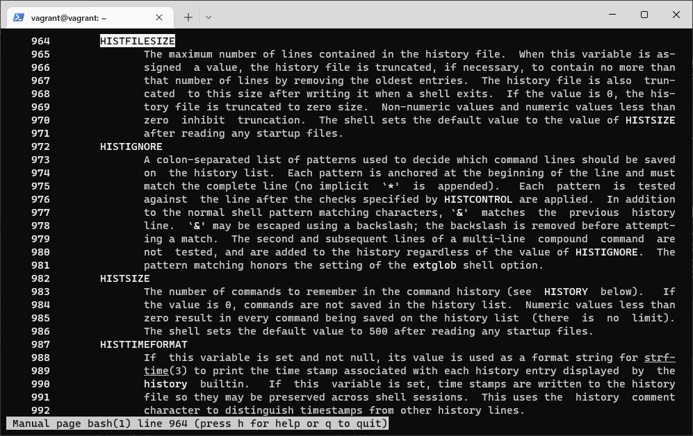
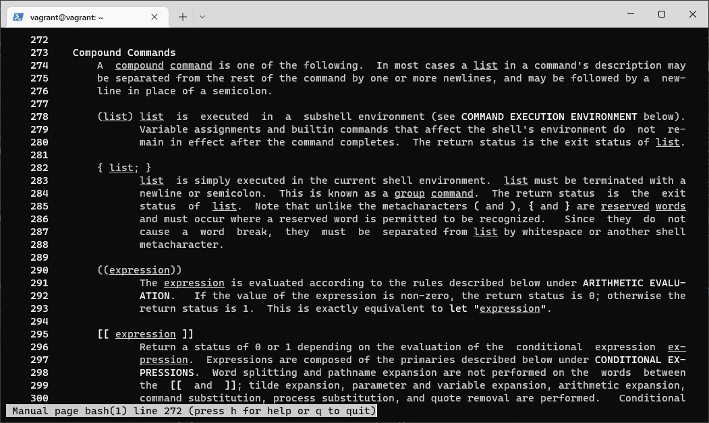

# Домашнее задание к занятию "3.1. Работа в терминале, лекция 1"

---
### Ознакомьтесь с графическим интерфейсом VirtualBox, посмотрите как выглядит виртуальная машина, которую создал для вас Vagrant, какие аппаратные ресурсы ей выделены. Какие ресурсы выделены по-умолчанию?
> 
>Выделено: 
>+ 2 процессора
>+ 1Гб оперативной памяти
>+ 64Гб жесткий диск
### Ознакомьтесь с возможностями конфигурации VirtualBox через Vagrantfile: документация. Как добавить оперативной памяти или ресурсов процессора виртуальной машине?
>Чтобы добавить оперативной памяти и процессоров необходимо скоректировать Vagrantfile. Выглядеть это будет примерно так.  
>``` 
>Vagrant.configure("2") do |config|
>   config.vm.box = "bento/ubuntu-20.04"
>   config.vm.provider "virtualbox" do |v|
>          v.name = "vargant_ubnt"  
>          v.memory = 2048
>          v.cpus = 4
>   end
>end
>```
> `v.name = "vargant_ubnt"` задаю имя виртуальной машины  
> `v.memory = 2048` выделяю 2Гб оперативной памяти  
> `v.cpus = 4` выделяю 4 CPU  
### какой переменной можно задать длину журнала history, и на какой строчке manual это описывается?
> перменная HISTSIZE отвечает за кол-во команд хранящиеся в журнале, описание в мануале на строчках 982..986  
> перменная HISTFILESIZE отвечает за максимальное кол-во строк, описание в мануале на строчках 964..971
> 
> храниться история в файле `.bash_history`  
> чтобы изменить длину журнала, необходимо внести изменения в файл `.bashrc` 
### что делает директива ignoreboth в bash?
> у переменной HISTCONTROL есть два флага ignoredups (исключает повторение комманд) и ignorespace (исключает команды начинающиеся с пробела), ignoreboth объединяет оба этих флага
### В каких сценариях использования применимы скобки {} и на какой строчке man bash это описано?
> { Список; }  
> Список просто выполняется в среде текущего командного интерпретатора.  
> Список должен завершаться переводом строки или точкой с запятой.  
> Эту команду называют командой группировки. Статусом возврата
> является статус выхода списка. , строка в man 282..288
> 
### С учётом ответа на предыдущий вопрос, как создать однократным вызовом touch 100000 файлов? Получится ли аналогичным образом создать 300000? Если нет, то почему?
> touch file-{1..100000}.txt - создаст 100000 файлов (на виртуалке получилось создать только 91557 файлов)  
> 300000 не получилось создать `-bash: /usr/bin/touch: Argument list too long` слишком длинный список
### В man bash поищите по `/\[\[`. Что делает конструкция `[[ -d /tmp ]]`
> `[[ -d /tmp ]]` - возвращает 0 или 1, существует ли каталог tmp
### Основываясь на знаниях о просмотре текущих (например, PATH) и установке новых переменных; командах, которые мы рассматривали, добейтесь в выводе type -a bash в виртуальной машине наличия первым пунктом в списке:
> `vagrant@vagrant:/tmp$ mkdir new_path_directory` - создаем директорию  
> `vagrant@vagrant:/tmp$ cp /bin/bash /tmp/new_path_directory/` - копируем в созданую директорию файл bash  
> `vagrant@vagrant:/tmp$ PATH=/tmp/new_path_directory/:$PATH` - добавляем каталог в переменную PATH  
> `vagrant@vagrant:/tmp$ type -a bash` - смотрим результат   
> `bash is /tmp/new_path_directory/bash`  
> `bash is /usr/bin/bash`  
> `bash is /bin/bash`  
### Чем отличается планирование команд с помощью batch и at?
> `at` - выполняет команды в указанное время  
> `batch` - выполняет команды, когда среднее значение нагрузки будет ниже 1,5