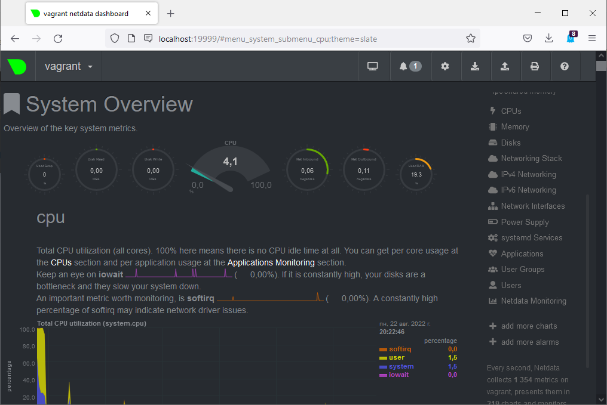

# Домашнее задание к занятию "3.4. Операционные системы, лекция 2"

---
### 1. Используя знания из лекции по systemd, создайте самостоятельно простой unit-файл для node_exporter: поместите его в автозагрузку, предусмотрите возможность добавления опций к запускаемому процессу через внешний файл (посмотрите, например, на systemctl cat cron), удостоверьтесь, что с помощью systemctl процесс корректно стартует, завершается, а после перезагрузки автоматически поднимается.
> скачиваем и копируем `node_exporter` в `/usr/local/bin/`  
> создаем unit-файл со следующим содержанием 
> ```commandline
> vagrant@vagrant:~$ cat /lib/systemd/system/node_exporter.service  
> [Unit]  
> Description=Node Exporter 1.4.0  
> [Service]  
> EnvironmentFile=-/etc/default/node_exporter  
> ExecStart=/usr/local/bin/node_exporter $COLL_OPTIONS  
> [Install] 
> WantedBy=multi-user.target  
>    ```
> добавляем в автозагрузку `sudo systemctl enable node_exporter.service`  
> также создаем файл для добавления опций
> ```commandline
> vagrant@vagrant:~$ cat /etc/default/node_exporter
> COLL_OPTIONS="--collector.disable-defaults --collector.cpu --collector.meminfo --collector.filesystem --collector.netdev"
> ```
> после использования комманд `systemctl stop node_exporter`,`systemctl start node_exporter` и после перезагрузки процесс поднимается  
> ```commandline
> vagrant@vagrant:~$ systemctl status node_exporter
> Warning: The unit file, source configuration file or drop-ins of node_exporter.service changed on disk. Run 'systemctl daemon-reload' to reload uni>
> ● node_exporter.service - Node Exporter 1.4.0
>      Loaded: loaded (/lib/systemd/system/node_exporter.service; enabled; vendor preset: enabled)
>      Active: active (running) since Sun 2022-08-21 20:13:07 UTC; 8s ago
>    Main PID: 2172 (node_exporter)
>       Tasks: 3 (limit: 1066)
>      Memory: 2.3M
>      CGroup: /system.slice/node_exporter.service
>              └─2172 /usr/local/bin/node_exporter
> 
> Aug 21 20:13:07 vagrant node_exporter[2172]: ts=2022-08-21T20:13:07.244Z caller=node_exporter.go:115 level=info collector=thermal_zone
> Aug 21 20:13:07 vagrant node_exporter[2172]: ts=2022-08-21T20:13:07.244Z caller=node_exporter.go:115 level=info collector=time
> Aug 21 20:13:07 vagrant node_exporter[2172]: ts=2022-08-21T20:13:07.244Z caller=node_exporter.go:115 level=info collector=timex
> Aug 21 20:13:07 vagrant node_exporter[2172]: ts=2022-08-21T20:13:07.244Z caller=node_exporter.go:115 level=info collector=udp_queues
> Aug 21 20:13:07 vagrant node_exporter[2172]: ts=2022-08-21T20:13:07.244Z caller=node_exporter.go:115 level=info collector=uname
> Aug 21 20:13:07 vagrant node_exporter[2172]: ts=2022-08-21T20:13:07.244Z caller=node_exporter.go:115 level=info collector=vmstat
> Aug 21 20:13:07 vagrant node_exporter[2172]: ts=2022-08-21T20:13:07.244Z caller=node_exporter.go:115 level=info collector=xfs
> Aug 21 20:13:07 vagrant node_exporter[2172]: ts=2022-08-21T20:13:07.244Z caller=node_exporter.go:115 level=info collector=zfs
> Aug 21 20:13:07 vagrant node_exporter[2172]: ts=2022-08-21T20:13:07.245Z caller=node_exporter.go:199 level=info msg="Listening on" address=:9100
> Aug 21 20:13:07 vagrant node_exporter[2172]: ts=2022-08-21T20:13:07.248Z caller=tls_config.go:195 level=info msg="TLS is disabled." http2=false
> 
> ```
### 2. Ознакомьтесь с опциями `node_exporter` и выводом `/metrics` по-умолчанию. Приведите несколько опций, которые вы бы выбрали для базового мониторинга хоста по CPU, памяти, диску и сети.
> слава великому grep'у))) `curl http://localhost:9100/metrics | grep HELP | grep cpu` а также по mem, filesystem, network  
> CPU:  
> `process_cpu_seconds_total` - Total user and system CPU time spent in seconds.  
> `node_cpu_seconds_total` - Seconds the CPUs spent in each mode.  
> память:    
> `node_memory_MemFree_bytes` Memory information field MemFree_bytes.    
> `node_memory_MemTotal_bytes` Memory information field MemTotal_bytes.  
> диск:  
> `node_filesystem_free_bytes` Filesystem free space in bytes.       
> `node_filesystem_size_bytes` Filesystem size in bytes.  
> сеть:    
> `node_network_device_id` device_id value of /sys/class/net/iface.    
> `node_network_up` Value is 1 if operstate is 'up', 0 otherwise.   
> `node_network_speed_bytes` speed_bytes value of /sys/class/net/iface.      
### 3. Установите в свою виртуальную машину Netdata. Воспользуйтесь готовыми пакетами для установки (sudo apt install -y netdata). После успешной установки:
#### в конфигурационном файле /etc/netdata/netdata.conf в секции [web] замените значение с localhost на bind to = 0.0.0.0,
#### добавьте в Vagrantfile проброс порта Netdata на свой локальный компьютер и сделайте vagrant reload:
#### config.vm.network "forwarded_port", guest: 19999, host: 19999
#### После успешной перезагрузки в браузере на своем ПК (не в виртуальной машине) вы должны суметь зайти на localhost:19999. Ознакомьтесь с метриками, которые по умолчанию собираются Netdata и с комментариями, которые даны к этим метрикам.
> 
### 4. Можно ли по выводу dmesg понять, осознает ли ОС, что загружена не на настоящем оборудовании, а на системе виртуализации?
> ```commandline
> vagrant@vagrant:~$ dmesg | grep -i virtual
> [    0.000000] DMI: innotek GmbH VirtualBox/VirtualBox, BIOS VirtualBox 12/01/2006
> [    0.004658] CPU MTRRs all blank - virtualized system.
> [    0.214354] Booting paravirtualized kernel on KVM
> [    4.008176] systemd[1]: Detected virtualization oracle.
>```
### 5. Как настроен sysctl `fs.nr_open` на системе по-умолчанию? Узнайте, что означает этот параметр. Какой другой существующий лимит не позволит достичь такого числа (`ulimit --help`)?
> `fs.nr_open` - Лимит на количество открытых дескрипторов,по умолчанию 1024*1024 = 1048576 
> ```commandline
> vagrant@vagrant:~$ sysctl -n fs.nr_open
> 1048576
> ```
> `ulimit` не позволит достичь, ибо он органичивает ресурсы на текущую сессию
> ```commandline
> vagrant@vagrant:~$ ulimit -n
> 1024
> ```
### 6. Запустите любой долгоживущий процесс (не ls, который отработает мгновенно, а, например, sleep 1h) в отдельном неймспейсе процессов; покажите, что ваш процесс работает под PID 1 через nsenter. Для простоты работайте в данном задании под root (sudo -i). Под обычным пользователем требуются дополнительные опции (--map-root-user) и т.д.
> ```commandline
> root@vagrant:/home/vagrant# unshare --fork --pid --mount-proc ping 8.8.8.8
> root@vagrant:/home/vagrant# ps aux |grep ping
> root        1341  0.0  0.0   5480   584 pts/0    S+   19:08   0:00 unshare --fork --pid --mount-proc ping 8.8.8.8
> root        1342  0.0  0.0   7092   928 pts/0    S+   19:08   0:00 ping 8.8.8.8
> root        1350  0.0  0.0   6300   656 pts/1    S+   19:08   0:00 grep --color=auto ping
> root@vagrant:/home/vagrant# nsenter --target 1342 --pid --mount
> root@vagrant:/# ps aux | grep ping
> root           1  0.0  0.0   7092   928 pts/0    S+   19:08   0:00 ping 8.8.8.8
> root          14  0.0  0.0   6300   724 pts/1    S+   19:10   0:00 grep --color=auto ping
> ```
### 7. Найдите информацию о том, что такое :(){ :|:& };:. Запустите эту команду в своей виртуальной машине Vagrant с Ubuntu 20.04 (это важно, поведение в других ОС не проверялось). Некоторое время все будет "плохо", после чего (минуты) – ОС должна стабилизироваться. Вызов dmesg расскажет, какой механизм помог автоматической стабилизации. Как настроен этот механизм по-умолчанию, и как изменить число процессов, которое можно создать в сессии?
> интернет говорит форк-бомба))) фунция которая вызывает 2 свои экземпляра, которые в свою очередь еще по 2 и т.д. рекурсия))) пока не закончатся ресурсы.       
> помог `cgroup` как я понял  
> `[  586.431300] cgroup: fork rejected by pids controller in /user.slice/user-1000.slice/session-1.scope`
> изменить число процессов поможет команда `ulimit -u n` где `n` число процессов.  
> 