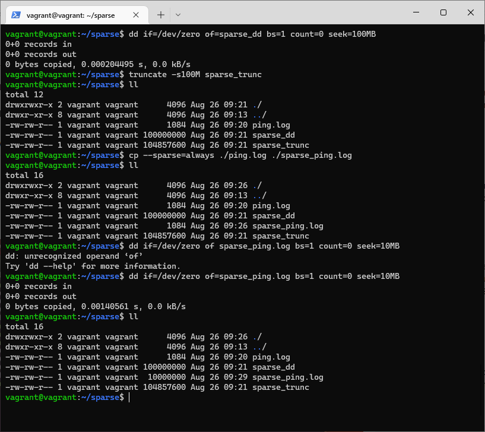
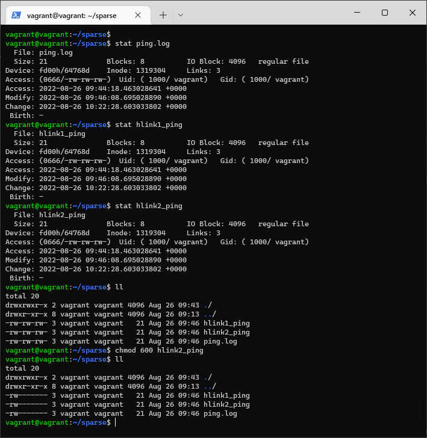
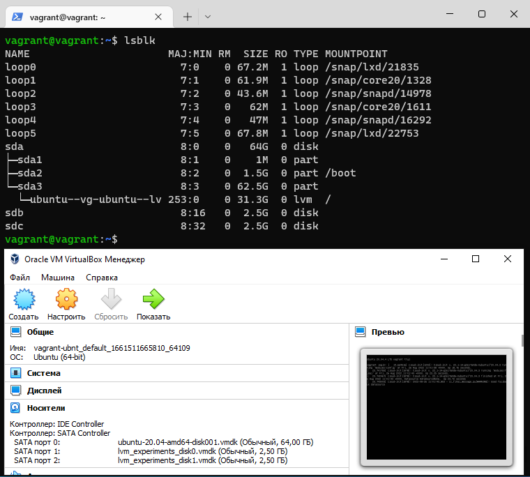

# Домашнее задание к занятию "3.5. Файловые системы"

---
### 1. Узнайте о `sparse` (разряженных) файлах.
> + Разреженные – это специальные файлы, которые с большей эффективностью используют файловую систему, они не позволяют ФС занимать свободное дисковое пространство носителя, когда разделы не заполнены. То есть, «пустое место» будет задействовано только при необходимости. Пустая информация в виде нулей, будет хранится в блоке метаданных ФС. Поэтому, разреженные файлы изначально занимают меньший объем носителя, чем их реальный объем.  
> + Приведу пример как создать (`dd`, `truncate`), преобразовать (`cp --sparse=always`), изменить размер такого файла   
>    
### 2. Могут ли файлы, являющиеся жесткой ссылкой на один объект, иметь разные права доступа и владельца? Почему?
> + нет, не могут. они имеюют один `inode`, и при изменении доступа одного изменяет доступ всем трем, например   
> 
### 3. Сделайте `vagrant destroy` на имеющийся инстанс Ubuntu. Замените содержимое Vagrantfile следующим:
> ```commandline
> Vagrant.configure("2") do |config|
>   config.vm.box = "bento/ubuntu-20.04"
>   config.vm.provider :virtualbox do |vb|
>     lvm_experiments_disk0_path = "/tmp/lvm_experiments_disk0.vmdk"
>     lvm_experiments_disk1_path = "/tmp/lvm_experiments_disk1.vmdk"
>     vb.customize ['createmedium', '--filename', lvm_experiments_disk0_path, '--size', 2560]
>     vb.customize ['createmedium', '--filename', lvm_experiments_disk1_path, '--size', 2560]
>     vb.customize ['storageattach', :id, '--storagectl', 'SATA Controller', '--port', 1, '--device', 0, '--type', 'hdd', '--medium', lvm_experiments_disk0_path]
>     vb.customize ['storageattach', :id, '--storagectl', 'SATA Controller', '--port', 2, '--device', 0, '--type', 'hdd', '--medium', lvm_experiments_disk1_path]
>   end
> end
> ```
> Данная конфигурация создаст новую виртуальную машину с двумя дополнительными неразмеченными дисками по 2.5 Гб.
>  
### 4. Используя `fdisk`, разбейте первый диск на 2 раздела: 2 Гб, оставшееся пространство.
> ```commandline
> vagrant@vagrant:~$ sudo fdisk /dev/sdb
> Welcome to fdisk (util-linux 2.34).
> Changes will remain in memory only, until you decide to write them.
> Be careful before using the write command.
> 
> Device does not contain a recognized partition table.
> Created a new DOS disklabel with disk identifier 0xa908b842.
> 
> Command (m for help): n
> Partition type
>    p   primary (0 primary, 0 extended, 4 free)
>    e   extended (container for logical partitions)
> Select (default p):
> 
> Using default response p.
> Partition number (1-4, default 1):
> First sector (2048-5242879, default 2048):
> Last sector, +/-sectors or +/-size{K,M,G,T,P} (2048-5242879, default 5242879): +2G
> 
> Created a new partition 1 of type 'Linux' and of size 2 GiB.
> 
> Command (m for help): n
> Partition type
>    p   primary (1 primary, 0 extended, 3 free)
>    e   extended (container for logical partitions)
> Select (default p):
> 
> Using default response p.
> Partition number (2-4, default 2):
> First sector (4196352-5242879, default 4196352):
> Last sector, +/-sectors or +/-size{K,M,G,T,P} (4196352-5242879, default 5242879):
> 
> Created a new partition 2 of type 'Linux' and of size 511 MiB.
> 
> Command (m for help): w
> The partition table has been altered.
> Calling ioctl() to re-read partition table.
> Syncing disks.
> 
> vagrant@vagrant:~$ lsblk
> NAME                      MAJ:MIN RM  SIZE RO TYPE MOUNTPOINT
> loop0                       7:0    0 67.2M  1 loop /snap/lxd/21835
> loop1                       7:1    0 61.9M  1 loop /snap/core20/1328
> loop2                       7:2    0 43.6M  1 loop /snap/snapd/14978
> loop3                       7:3    0   62M  1 loop /snap/core20/1611
> loop4                       7:4    0   47M  1 loop /snap/snapd/16292
> loop5                       7:5    0 67.8M  1 loop /snap/lxd/22753
> sda                         8:0    0   64G  0 disk
> ├─sda1                      8:1    0    1M  0 part
> ├─sda2                      8:2    0  1.5G  0 part /boot
> └─sda3                      8:3    0 62.5G  0 part
>   └─ubuntu--vg-ubuntu--lv 253:0    0 31.3G  0 lvm  /
> sdb                         8:16   0  2.5G  0 disk
> ├─sdb1                      8:17   0    2G  0 part
> └─sdb2                      8:18   0  511M  0 part
> sdc                         8:32   0  2.5G  0 disk
> ```
### 5. Используя sfdisk, перенесите данную таблицу разделов на второй диск.
> ```commandline
> vagrant@vagrant:~$ sudo sfdisk -d /dev/sdb | sudo sfdisk /dev/sdc
> Checking that no-one is using this disk right now ... OK
> 
> Disk /dev/sdc: 2.51 GiB, 2684354560 bytes, 5242880 sectors
> Disk model: VBOX HARDDISK
> Units: sectors of 1 * 512 = 512 bytes
> Sector size (logical/physical): 512 bytes / 512 bytes
> I/O size (minimum/optimal): 512 bytes / 512 bytes
> 
> >>> Script header accepted.
> >>> Script header accepted.
> >>> Script header accepted.
> >>> Script header accepted.
> >>> Created a new DOS disklabel with disk identifier 0xa908b842.
> /dev/sdc1: Created a new partition 1 of type 'Linux' and of size 2 GiB.
> /dev/sdc2: Created a new partition 2 of type 'Linux' and of size 511 MiB.
> /dev/sdc3: Done.
> 
> New situation:
> Disklabel type: dos
> Disk identifier: 0xa908b842
> 
> Device     Boot   Start     End Sectors  Size Id Type
> /dev/sdc1          2048 4196351 4194304    2G 83 Linux
> /dev/sdc2       4196352 5242879 1046528  511M 83 Linux
> 
> The partition table has been altered.
> Calling ioctl() to re-read partition table.
> Syncing disks.
> ```
### 6. Соберите mdadm RAID1 на паре разделов 2 Гб.
> ```commandline
> vagrant@vagrant:~$ sudo mdadm --create /dev/md0 -l 1 -n 2 /dev/sd{b1,c1}
> mdadm: Note: this array has metadata at the start and
>     may not be suitable as a boot device.  If you plan to
>     store '/boot' on this device please ensure that
>     your boot-loader understands md/v1.x metadata, or use
>     --metadata=0.90
> Continue creating array? y
> mdadm: Defaulting to version 1.2 metadata
> mdadm: array /dev/md0 started.
> ```
### 7. Соберите mdadm RAID0 на второй паре маленьких разделов.
> ```commandline
> vagrant@vagrant:~$ sudo mdadm --create /dev/md1 -l raid0 -n 2 /dev/sd{b,c}2
> mdadm: Defaulting to version 1.2 metadata
> mdadm: array /dev/md1 started.
> vagrant@vagrant:~$ lsblk
> NAME                      MAJ:MIN RM  SIZE RO TYPE  MOUNTPOINT
> loop0                       7:0    0 67.2M  1 loop  /snap/lxd/21835
> loop1                       7:1    0 61.9M  1 loop  /snap/core20/1328
> loop2                       7:2    0 43.6M  1 loop  /snap/snapd/14978
> loop3                       7:3    0   62M  1 loop  /snap/core20/1611
> loop4                       7:4    0   47M  1 loop  /snap/snapd/16292
> loop5                       7:5    0 67.8M  1 loop  /snap/lxd/22753
> sda                         8:0    0   64G  0 disk
> ├─sda1                      8:1    0    1M  0 part
> ├─sda2                      8:2    0  1.5G  0 part  /boot
> └─sda3                      8:3    0 62.5G  0 part
>   └─ubuntu--vg-ubuntu--lv 253:0    0 31.3G  0 lvm   /
> sdb                         8:16   0  2.5G  0 disk
> ├─sdb1                      8:17   0    2G  0 part
> │ └─md0                     9:0    0    2G  0 raid1
> └─sdb2                      8:18   0  511M  0 part
>   └─md1                     9:1    0 1018M  0 raid0
> sdc                         8:32   0  2.5G  0 disk
> ├─sdc1                      8:33   0    2G  0 part
> │ └─md0                     9:0    0    2G  0 raid1
> └─sdc2                      8:34   0  511M  0 part
>   └─md1                     9:1    0 1018M  0 raid0
> ```
### 8. Создайте 2 независимых PV на получившихся md-устройствах.
> ```commandline
> vagrant@vagrant:~$ sudo pvcreate /dev/md0 /dev/md1
>   Physical volume "/dev/md0" successfully created.
>   Physical volume "/dev/md1" successfully created.
> vagrant@vagrant:~$ sudo pvs
>  PV         VG        Fmt  Attr PSize    PFree
>  /dev/md0             lvm2 ---    <2.00g   <2.00g
>  /dev/md1             lvm2 ---  1018.00m 1018.00m
>  /dev/sda3  ubuntu-vg lvm2 a--   <62.50g   31.25g
> ```
### 9. Создайте общую volume-group на этих двух PV.
> ```commandline
> vagrant@vagrant:~$  sudo vgcreate vg01 /dev/md0 /dev/md1
>   Volume group "vg01" successfully created
> vagrant@vagrant:~$ sudo pvs
>   PV         VG        Fmt  Attr PSize    PFree
>   /dev/md0   vg01      lvm2 a--    <2.00g   <2.00g
>   /dev/md1   vg01      lvm2 a--  1016.00m 1016.00m
>   /dev/sda3  ubuntu-vg lvm2 a--   <62.50g   31.25g
> vagrant@vagrant:~$ sudo vgs
>   VG        #PV #LV #SN Attr   VSize   VFree
>   ubuntu-vg   1   1   0 wz--n- <62.50g 31.25g
>   vg01        2   0   0 wz--n-  <2.99g <2.99g
> ```
### 10. Создайте LV размером 100 Мб, указав его расположение на PV с RAID0.
> ```commandline
> vagrant@vagrant:~$ sudo lvcreate -n my_disk1 -L 100M vg01 /dev/md1
>   Logical volume "my_disk1" created.
> vagrant@vagrant:~$ sudo lvs
>   LV        VG        Attr       LSize   Pool Origin Data%  Meta%  Move Log Cpy%Sync Convert
>   ubuntu-lv ubuntu-vg -wi-ao---- <31.25g
>   my_disk1  vg01      -wi-a----- 100.00m
> ```
### 11. Создайте `mkfs.ext4` ФС на получившемся LV.
> ```commandline
> vagrant@vagrant:~$ sudo mkfs.ext4 /dev/vg01/my_disk1
> mke2fs 1.45.5 (07-Jan-2020)
> Creating filesystem with 25600 4k blocks and 25600 inodes
> 
> Allocating group tables: done
> Writing inode tables: done
> Creating journal (1024 blocks): done
> Writing superblocks and filesystem accounting information: done
> ```
### 12. Смонтируйте этот раздел в любую директорию, например, `/tmp/new`.
> ```commandline
> vagrant@vagrant:~$ mkdir /tmp/new
> vagrant@vagrant:~$ sudo mount /dev/vg01/my_disk1 /tmp/new/
> ```
### 13. Поместите туда тестовый файл, например `wget https://mirror.yandex.ru/ubuntu/ls-lR.gz -O /tmp/new/test.gz`
> ```commandline
> vagrant@vagrant:~$ sudo wget https://mirror.yandex.ru/ubuntu/ls-lR.gz -O /tmp/new/test.gz
> --2022-08-26 17:06:36--  https://mirror.yandex.ru/ubuntu/ls-lR.gz
> Resolving mirror.yandex.ru (mirror.yandex.ru)... 213.180.204.183, 2a02:6b8::183
> Connecting to mirror.yandex.ru (mirror.yandex.ru)|213.180.204.183|:443... connected.
> HTTP request sent, awaiting response... 200 OK
> Length: 22408899 (21M) [application/octet-stream]
> Saving to: ‘/tmp/new/test.gz’
> 
> /tmp/new/test.gz              100%[=================================================>]  21.37M  2.50MB/s    in 9.4s
> 
> 2022-08-26 17:06:46 (2.27 MB/s) - ‘/tmp/new/test.gz’ saved [22408899/22408899]
> 
> vagrant@vagrant:~$ ll /tmp/new/
> total 21908
> drwxr-xr-x  3 root root     4096 Aug 26 17:06 ./
> drwxrwxrwt 12 root root     4096 Aug 26 16:55 ../
> drwx------  2 root root    16384 Aug 26 16:51 lost+found/
> -rw-r--r--  1 root root 22408899 Aug 26 14:59 test.gz
> ```
### 14. Прикрепите вывод `lsblk`.
> ```commandline
> vagrant@vagrant:~$ lsblk
> NAME                      MAJ:MIN RM  SIZE RO TYPE  MOUNTPOINT
> loop0                       7:0    0 67.2M  1 loop  /snap/lxd/21835
> loop1                       7:1    0 61.9M  1 loop  /snap/core20/1328
> loop2                       7:2    0 43.6M  1 loop  /snap/snapd/14978
> loop3                       7:3    0   62M  1 loop  /snap/core20/1611
> loop4                       7:4    0   47M  1 loop  /snap/snapd/16292
> loop5                       7:5    0 67.8M  1 loop  /snap/lxd/22753
> sda                         8:0    0   64G  0 disk
> ├─sda1                      8:1    0    1M  0 part
> ├─sda2                      8:2    0  1.5G  0 part  /boot
> └─sda3                      8:3    0 62.5G  0 part
>   └─ubuntu--vg-ubuntu--lv 253:0    0 31.3G  0 lvm   /
> sdb                         8:16   0  2.5G  0 disk
> ├─sdb1                      8:17   0    2G  0 part
> │ └─md0                     9:0    0    2G  0 raid1
> └─sdb2                      8:18   0  511M  0 part
>   └─md1                     9:1    0 1018M  0 raid0
>     └─vg01-my_disk1       253:1    0  100M  0 lvm   /tmp/new
> sdc                         8:32   0  2.5G  0 disk
> ├─sdc1                      8:33   0    2G  0 part
> │ └─md0                     9:0    0    2G  0 raid1
> └─sdc2                      8:34   0  511M  0 part
>   └─md1                     9:1    0 1018M  0 raid0
>     └─vg01-my_disk1       253:1    0  100M  0 lvm   /tmp/new
> ```
### 15. Протестируйте целостность файла:
> ```commandline
> vagrant@vagrant:~$ gzip -t /tmp/new/test.gz
> vagrant@vagrant:~$ echo $?
> 0
> ```
### 16. Используя pvmove, переместите содержимое PV с RAID0 на RAID1.
> ```commandline
> vagrant@vagrant:~$ sudo pvmove /dev/md1 /dev/md0
>   /dev/md1: Moved: 16.00%
>   /dev/md1: Moved: 100.00%
> vagrant@vagrant:~$ lsblk
> NAME                      MAJ:MIN RM  SIZE RO TYPE  MOUNTPOINT
> loop0                       7:0    0 67.2M  1 loop  /snap/lxd/21835
> loop1                       7:1    0 61.9M  1 loop  /snap/core20/1328
> loop2                       7:2    0 43.6M  1 loop  /snap/snapd/14978
> loop3                       7:3    0   62M  1 loop  /snap/core20/1611
> loop4                       7:4    0   47M  1 loop  /snap/snapd/16292
> loop5                       7:5    0 67.8M  1 loop  /snap/lxd/22753
> sda                         8:0    0   64G  0 disk
> ├─sda1                      8:1    0    1M  0 part
> ├─sda2                      8:2    0  1.5G  0 part  /boot
> └─sda3                      8:3    0 62.5G  0 part
>   └─ubuntu--vg-ubuntu--lv 253:0    0 31.3G  0 lvm   /
> sdb                         8:16   0  2.5G  0 disk
> ├─sdb1                      8:17   0    2G  0 part
> │ └─md0                     9:0    0    2G  0 raid1
> │   └─vg01-my_disk1       253:1    0  100M  0 lvm   /tmp/new
> └─sdb2                      8:18   0  511M  0 part
>   └─md1                     9:1    0 1018M  0 raid0
> sdc                         8:32   0  2.5G  0 disk
> ├─sdc1                      8:33   0    2G  0 part
> │ └─md0                     9:0    0    2G  0 raid1
> │   └─vg01-my_disk1       253:1    0  100M  0 lvm   /tmp/new
> └─sdc2                      8:34   0  511M  0 part
>   └─md1                     9:1    0 1018M  0 raid0
> ```
### 17. Сделайте --fail на устройство в вашем RAID1 md
> ```commandline
> vagrant@vagrant:~$ sudo mdadm /dev/md0 --fail /dev/sdc1
> mdadm: set /dev/sdc1 faulty in /dev/md0
> vagrant@vagrant:~$ cat /proc/mdstat
> Personalities : [linear] [multipath] [raid0] [raid1] [raid6] [raid5] [raid4] [raid10]
> md1 : active raid0 sdc2[1] sdb2[0]
>       1042432 blocks super 1.2 512k chunks
> 
> md0 : active raid1 sdc1[1](F) sdb1[0]
>       2094080 blocks super 1.2 [2/1] [U_]
> 
> unused devices: <none>
> ```
### 18. Подтвердите выводом dmesg, что RAID1 работает в деградированном состоянии.
> ```commandline
> vagrant@vagrant:~$ dmesg | grep md0
> [33433.300670] md/raid1:md0: Disk failure on sdc1, disabling device.
>                md/raid1:md0: Operation continuing on 1 devices.
> ```
### 19. Протестируйте целостность файла, несмотря на "сбойный" диск он должен продолжать быть доступен:
> ```commandline
> vagrant@vagrant:~$ gzip -t /tmp/new/test.gz
> vagrant@vagrant:~$ echo $?
> 0
> ```
