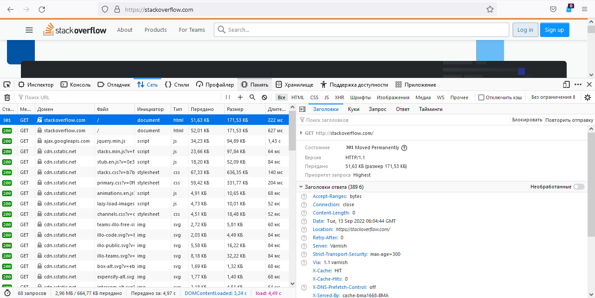

# Домашнее задание к занятию "3.6. Компьютерные сети, лекция 1"

---
### 1. Работа c HTTP через телнет. Подключитесь утилитой телнет к сайту stackoverflow.com `telnet stackoverflow.com 80`
> ```commandline
> vagrant@vagrant:~$ telnet stackoverflow.com 80
> Trying 151.101.1.69...
> Connected to stackoverflow.com.
> Escape character is '^]'.
> GET /questions HTTP/1.0
> HOST: stackoverflow.com
> 
> HTTP/1.1 301 Moved Permanently
> Server: Varnish
> Retry-After: 0
> Location: https://stackoverflow.com/questions
> Content-Length: 0
> Accept-Ranges: bytes
> Date: Tue, 06 Sep 2022 15:41:20 GMT
> Via: 1.1 varnish
> Connection: close
> X-Served-By: cache-bma1675-BMA
> X-Cache: HIT
> X-Cache-Hits: 0
> X-Timer: S1662478880.289183,VS0,VE0
> Strict-Transport-Security: max-age=300
> X-DNS-Prefetch-Control: off
> 
> Connection closed by foreign host.
> ```
> В ответ получили `HTTP/1.1 301 Moved Permanently`, этот код перенаправления означает, что запрошеный ресурс был перемещен в `Location: https://stackoverflow.com/questions`
### 2. Повторите задание 1 в браузере, используя консоль разработчика F12.
>  
> первый ответ сервера получили такой же код 301  
> дольше всего обрабатывался второй запрос переход на `https://stackoverflow.com/` 625мс.  
### 3. Какой IP адрес у вас в интернете?
> существует масса сервисов, например в браузере: `https://whoer.net/ru`, `https://www.speedtest.net/`, `https://2ip.ru/`  
> либо в консоли: `wget -qO- eth0.me`, `curl ident.me`
> ```commandline
> vagrant@vagrant:~$ wget -qO- eth0.me
> 37.###.###.###
> ```
### 4. Какому провайдеру принадлежит ваш IP адрес? Какой автономной системе AS? Воспользуйтесь утилитой `whois`
> провайдер: RU-BEELINE-BROADBAND-GLOBAL  
> AS: AS8402
> ```commandline
> whois -T route $(curl ident.me)
> route:          37.144.143.0/24
> descr:          RU-BEELINE-BROADBAND-GLOBAL
> origin:         AS8402
> mnt-by:         RU-CORBINA-MNT
> created:        2012-03-27T11:25:27Z
> last-modified:  2012-03-27T11:25:27Z
> source:         RIPE # Filtered
> ```
### 5. Через какие сети проходит пакет, отправленный с вашего компьютера на адрес 8.8.8.8? Через какие AS? Воспользуйтесь утилитой `traceroute`
> ```commandline
> vagrant@vagrant:~$ traceroute -IAn 8.8.8.8
> traceroute to 8.8.8.8 (8.8.8.8), 30 hops max, 60 byte packets
> 1  10.0.2.2 [*]  0.401 ms  0.327 ms  0.309 ms
> 2  192.168.1.1 [*]  22.008 ms  21.913 ms  21.680 ms
> 3  2.92.40.1 [AS3216/AS8402]  21.641 ms  21.508 ms  21.570 ms
> 4  78.107.138.96 [AS8402]  21.402 ms  21.316 ms  21.409 ms
> 5  213.221.39.16 [AS3216]  24.562 ms  24.830 ms  24.859 ms
> 6  79.104.235.205 [AS3216]  52.948 ms  34.138 ms  34.208 ms
> 7  195.68.176.50 [AS3216]  36.260 ms  32.991 ms  33.187 ms
> 8  142.251.68.221 [AS15169]  32.723 ms  32.850 ms  32.780 ms
> 9  108.170.250.66 [AS15169]  33.194 ms  33.463 ms  33.258 ms
> 10  142.250.238.214 [AS15169]  54.531 ms  54.696 ms  54.632 ms
> 11  142.250.235.74 [AS15169]  48.926 ms  49.163 ms  46.420 ms
> 12  216.239.49.107 [AS15169]  51.279 ms  52.345 ms  51.179 ms
> 13  * * *
> 14  * * *
> 15  * * *
> 16  * * *
> 17  * * *
> 18  * * *
> 19  * * *
> 20  * * *
> 21  * * *
> 22  8.8.8.8 [AS15169]  52.256 ms  45.030 ms  47.684 ms
> ```
### 6. Повторите задание 5 в утилите `mtr`. На каком участке наибольшая задержка - delay?
> HOST — имя хоста  
> Loss% — процент потерь пакетов  
> Snt — количество отправленных пакетов  
> Last — время задержки последнего отправленного пакета в миллисекундах  
> Avg — среднее время задержки  
> Best — минимальное время задержки  
> Wrst — максимальное время задержки  
> StDev — среднеквадратичное отклонение времени задержки  
> ```commandline
> vagrant@vagrant:~$ mtr -r 8.8.8.8
> Start: 2022-09-13T07:46:39+0000
> HOST: vagrant                     Loss%   Snt   Last   Avg  Best  Wrst StDev
>  1.|-- _gateway                   0.0%    10    0.3   0.4   0.3   0.6   0.1
>  2.|-- 192.168.1.1                0.0%    10    4.1   3.5   2.1   6.9   1.7
>  3.|-- 2.92.40.1                  0.0%    10    2.9   3.6   2.9   5.2   0.9
>  4.|-- 78.107.138.96              0.0%    10    6.2   4.8   2.9   8.7   2.3
>  5.|-- 213.221.39.16              0.0%    10    4.0   4.8   3.1   6.9   1.3
>  6.|-- pe16.Moscow.gldn.net       0.0%    10   31.3  32.8  31.3  34.8   1.3
>  7.|-- 195.68.176.50              0.0%    10   35.8  33.2  31.3  38.0   2.2
>  8.|-- 142.251.68.221             0.0%    10   31.4  32.3  31.1  36.7   1.7
>  9.|-- 108.170.250.66             0.0%    10   32.2  34.2  31.9  48.4   5.0
> 10.|-- 142.250.238.214            0.0%    10   55.4  53.9  52.5  55.4   1.1
> 11.|-- 142.250.235.74             0.0%    10   47.2  46.4  45.8  48.3   0.8
> 12.|-- 216.239.49.107             0.0%    10   52.8  52.1  50.4  55.0   1.5
> 13.|-- ???                       100.0    10    0.0   0.0   0.0   0.0   0.0
> 14.|-- ???                       100.0    10    0.0   0.0   0.0   0.0   0.0
> 15.|-- ???                       100.0    10    0.0   0.0   0.0   0.0   0.0
> 16.|-- ???                       100.0    10    0.0   0.0   0.0   0.0   0.0
> 17.|-- ???                       100.0    10    0.0   0.0   0.0   0.0   0.0
> 18.|-- ???                       100.0    10    0.0   0.0   0.0   0.0   0.0
> 19.|-- ???                       100.0    10    0.0   0.0   0.0   0.0   0.0
> 20.|-- ???                       100.0    10    0.0   0.0   0.0   0.0   0.0
> 21.|-- ???                       100.0    10    0.0   0.0   0.0   0.0   0.0
> 22.|-- dns.google                 0.0%    10   44.8  46.2  44.8  50.1   1.6
> ```
> максимальная время задержки на 10 участке, параметр `Wrst = 55.4`
### 7. Какие DNS сервера отвечают за доменное имя dns.google? Какие A записи? воспользуйтесь утилитой `dig`
> ```commandline
> vagrant@vagrant:~$ dig NS dns.google +short
> ns1.zdns.google.
> ns2.zdns.google.
> ns4.zdns.google.
> ns3.zdns.google.
> vagrant@vagrant:~$ dig A dns.google +short
> 8.8.4.4
> 8.8.8.8
> ```
### 8. Проверьте PTR записи для IP адресов из задания 7. Какое доменное имя привязано к IP? воспользуйтесь утилитой `dig`
> `dns.google.` привязано к обеим адресам
> ```commandline
>vagrant@vagrant:~$ dig -x 8.8.4.4 +noall +answer
> 4.4.8.8.in-addr.arpa.   1       IN      PTR     dns.google.
> vagrant@vagrant:~$ dig -x 8.8.8.8 +noall +answer
> 8.8.8.8.in-addr.arpa.   1       IN      PTR     dns.google.
> ```