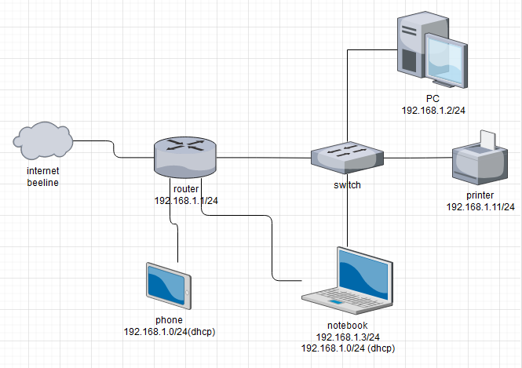

# Домашнее задание к занятию "3.8. Компьютерные сети, лекция 3"

---
### 1. Подключитесь к публичному маршрутизатору в интернет. Найдите маршрут к вашему публичному IP
> ```commandline
> route-views>show ip route 95.31.104.210
> Routing entry for 95.31.104.0/24
>   Known via "bgp 6447", distance 20, metric 0
>   Tag 3267, type external
>   Last update from 194.85.40.15 4d05h ago
>   Routing Descriptor Blocks:
>   * 194.85.40.15, from 194.85.40.15, 4d05h ago
>       Route metric is 0, traffic share count is 1
>      AS Hops 2
>      Route tag 3267
>      MPLS label: none
> route-views>show bgp 95.31.104.210
> BGP routing table entry for 95.31.104.0/24, version 2423658563
> Paths: (3 available, best #1, table default)
>  Not advertised to any peer
>  Refresh Epoch 1
>  3267 3216
>    194.85.40.15 from 194.85.40.15 (185.141.126.1)
>      Origin incomplete, metric 0, localpref 100, valid, external, best
>      path 7FE0386FDF48 RPKI State not found
>      rx pathid: 0, tx pathid: 0x0
>  Refresh Epoch 1
>  8283 57866 9002 3216
>    94.142.247.3 from 94.142.247.3 (94.142.247.3)
>      Origin IGP, metric 0, localpref 100, valid, external
>      Community: 8283:15 9002:9002 9002:64667
>      unknown transitive attribute: flag 0xE0 type 0x20 length 0xC
>        value 0000 205B 0000 0006 0000 000F
>      path 7FE13A27B980 RPKI State not found
>      rx pathid: 0, tx pathid: 0
>  Refresh Epoch 1
>  57866 9002 3216
>    37.139.139.17 from 37.139.139.17 (37.139.139.17)
>      Origin IGP, metric 0, localpref 100, valid, external
>      Community: 9002:9002 9002:64667
>      path 7FE088115D10 RPKI State not found
>      rx pathid: 0, tx pathid: 0
> ```
### 2. Создайте dummy0 интерфейс в Ubuntu. Добавьте несколько статических маршрутов. Проверьте таблицу маршрутизации.
> ```commandline
> vagrant@vagrant:~$ sudo ip link add dummy0 type dummy
> vagrant@vagrant:~$ sudo ip address add 192.168.20.11/24 dev dummy0
> vagrant@vagrant:~$ sudo ip link set dummy0 up
> vagrant@vagrant:~$ ip a show type dummy
> 5: dummy0: <BROADCAST,NOARP,UP,LOWER_UP> mtu 1500 qdisc noqueue state UNKNOWN group default qlen 1000
>    link/ether 66:11:29:35:dd:74 brd ff:ff:ff:ff:ff:ff
>    inet 192.168.20.11/24 scope global dummy0
>       valid_lft forever preferred_lft forever
>    inet6 fe80::6411:29ff:fe35:dd74/64 scope link
>       valid_lft forever preferred_lft forever
> ```
> ```commandline
> vagrant@vagrant:~$ sudo ip route add 192.168.30.0/24 via 10.0.2.1
> vagrant@vagrant:~$ sudo ip route add 192.168.30.0/24 dev eth0
> RTNETLINK answers: File exists
> vagrant@vagrant:~$ ip route
> default via 10.0.2.2 dev eth0 proto dhcp src 10.0.2.15 metric 100
> 10.0.2.0/24 dev eth0 proto kernel scope link src 10.0.2.15
> 10.0.2.2 dev eth0 proto dhcp scope link src 10.0.2.15 metric 100
> 192.168.1.0/24 dev bond0 proto kernel scope link src 192.168.1.123 linkdown
> 192.168.20.0/24 dev dummy0 proto kernel scope link src 192.168.20.11
> 192.168.30.0/24 via 10.0.2.1 dev eth0 
> ```
### 3. Проверьте открытые TCP порты в Ubuntu, какие протоколы и приложения используют эти порты? Приведите несколько примеров.
> параметры ss:  
> -p Отображает PID.  
> -l Показывает только прослушивающие порты.   
> -u Показать порты UDP.  
> -t Показать TCP-порты.  
> ```commandline
> vagrant@vagrant:~$ sudo ss -plnt
> State        Recv-Q       Send-Q             Local Address:Port             Peer Address:Port      Process
> LISTEN       0            4096               127.0.0.53%lo:53                    0.0.0.0:*          users:(("systemd-resolve",pid=592,fd=13))
> LISTEN       0            128                      0.0.0.0:22                    0.0.0.0:*          users:(("sshd",pid=671,fd=3))
> LISTEN       0            128                         [::]:22                       [::]:*          users:(("sshd",pid=671,fd=4))
> ``` 
> порт 53 использует systemd-resolved — служба systemd. это по сути маленький локальный кэширующий dns-сервер, принимающий запросы на 127.0.0.53:53  
> порт 22 использует ssh  
### 4. Проверьте используемые UDP сокеты в Ubuntu, какие протоколы и приложения используют эти порты?  
> ```commandline
> vagrant@vagrant:~$ sudo ss -plnu
> State        Recv-Q       Send-Q              Local Address:Port             Peer Address:Port      Process
> UNCONN       0            0                   127.0.0.53%lo:53                    0.0.0.0:*          users:(("systemd-resolve",pid=592,fd=12))
> UNCONN       0            0                  10.0.2.15%eth0:68                    0.0.0.0:*          users:(("systemd-network",pid=585,fd=20))
> ```
### 5. Используя diagrams.net, создайте L3 диаграмму вашей домашней сети или любой другой сети, с которой вы работали.
>  