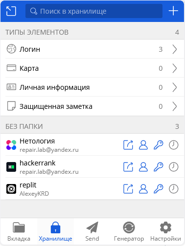
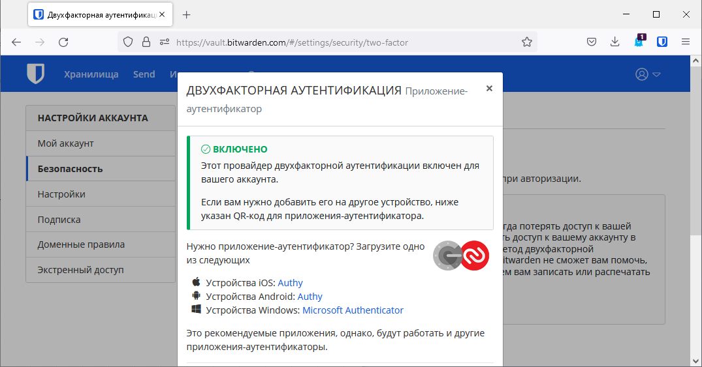
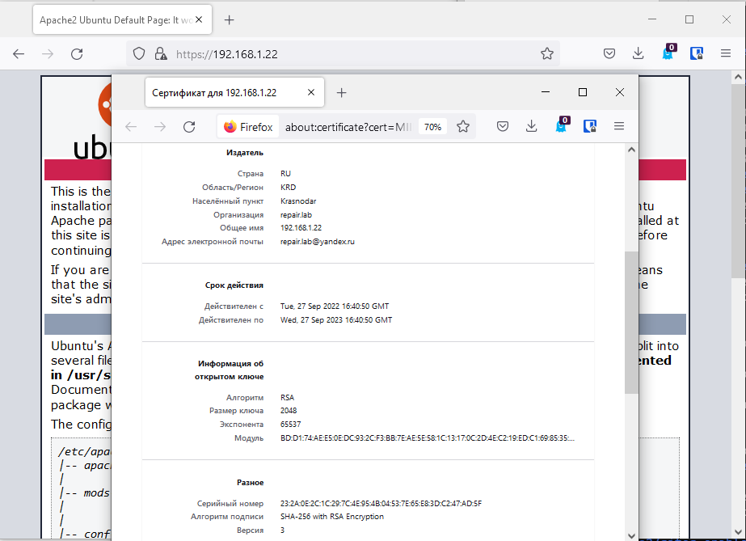
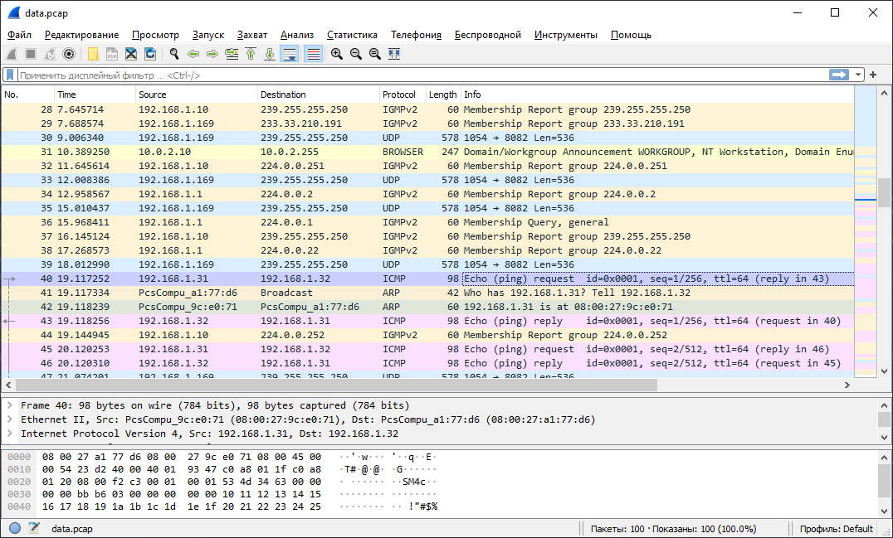

# Домашнее задание к занятию "3.9. Элементы безопасности информационных систем"

---
### 1. Установите Bitwarden плагин для браузера. Зарегестрируйтесь и сохраните несколько паролей.
>  
### 2. Установите Google authenticator на мобильный телефон. Настройте вход в Bitwarden акаунт через Google authenticator OTP.
>  
>  
### 3. Установите apache2, сгенерируйте самоподписанный сертификат, настройте тестовый сайт для работы по HTTPS.
> ```commandline
> vagrant@vagrant:~$ sudo apt install apache2
> vagrant@vagrant:~$ sudo openssl req -x509 -nodes -days 365 -newkey rsa:2048 -keyout /etc/ssl/my/apache-selfsigned.key -out /etc/ssl/my/apache-selfsigned.crt
> ```
> где:   
> openssl: это базовый инструмент командной строки для создания и управления сертификатами OpenSSL, ключами и другими файлами.  
> req: данная субкоманда указывает, что мы хотим использовать управление запросами подписи сертификатов X.509 (CSR). X.509 — это стандарт инфраструктуры открытых ключей, используемый SSL и TLS для управления ключами и сертификатами. Вы хотим создать новый сертификат X.509, и поэтому используем эту субкоманду.      
> -x509: это дополнительно изменяет предыдущую субкоманду, сообщая утилите, что мы хотим создать самоподписанный сертификат, а не сгенерировать запрос на подпись сертификата, как обычно происходит.  
> -nodes: этот параметр указывает OpenSSL пропустить опцию защиты сертификата с помощью пароля. Для чтения этого файла при запуске сервера без вмешательства пользователя нам потребуется Apache. Кодовая фраза может предотвратить это, поскольку нам придется вводить ее после каждого перезапуска.  
> -days 365: данный параметр устанавливает срок, в течение которого сертификат будет считаться действительным. Здесь мы устанавливаем срок действия в один год.  
> -newkey rsa:2048: указывает, что мы хотим генерировать новый сертификат и новый ключ одновременно. Мы не создали требуемый ключ для подписи сертификата на предыдущем шаге, и поэтому нам нужно создать его вместе с сертификатом. Часть rsa:2048 указывает, что мы создаем ключ RSA длиной 2048 бит.  
> -keyout: эта строка указывает OpenSSL, где мы разместим создаваемый закрытый ключ.  
> -out: данный параметр указывает OpenSSL, куда поместить создаваемый сертификат.  
> добавляем в файл `/etc/apache2/sites-enabled/000-default.conf`
> ```commandline
> <VirtualHost *:443>
>    ServerName 192.168.1.22
>    DocumentRoot /var/www/html
>    SSLEngine on
>    SSLCertificateFile /etc/ssl/my/apache-selfsigned.crt
>    SSLCertificateKeyFile /etc/ssl/my/apache-selfsigned.key
> </VirtualHost>
> ```
> `vagrant@vgr02:~$ apachectl configtest` - Проверяем корректность настроек  
> `vagrant@vgr02:~$ sudo apachectl graceful` - Перечитываем конфигурацию   
> и результат)  
>  
### 4. Проверьте на TLS уязвимости произвольный сайт в интернете (кроме сайтов МВД, ФСБ, МинОбр, НацБанк, РосКосмос, РосАтом, РосНАНО и любых госкомпаний, объектов КИИ, ВПК ... и тому подобное).  
> ```commandline
> vagrant@vgr02:~$ git clone --depth 1 https://github.com/drwetter/testssl.sh.git
> vagrant@vgr02:~$ ./testssl.sh/testssl.sh -U --sneaky https://netology.ru
> Testing all IPv4 addresses (port 443): 188.114.99.201 188.114.98.201
> ------------------------------------------------
>  Start 2022-09-27 17:59:07        -->> 188.114.99.201:443 (netology.ru) <<--
> 
>  Further IP addresses:   188.114.98.201 2a06:98c1:3123:c000::9
>                          2a06:98c1:3122:c000::9
>  rDNS (188.114.99.201):  --
>  Service detected:       HTTP
>
>
>  Testing vulnerabilities
>
> Heartbleed (CVE-2014-0160)                not vulnerable (OK), no heartbeat extension
> CCS (CVE-2014-0224)                       not vulnerable (OK)
> Ticketbleed (CVE-2016-9244), experiment.  not vulnerable (OK)
> ROBOT                                     not vulnerable (OK)
> Secure Renegotiation (RFC 5746)           supported (OK)
> Secure Client-Initiated Renegotiation     not vulnerable (OK)
> CRIME, TLS (CVE-2012-4929)                not vulnerable (OK)
> BREACH (CVE-2013-3587)                    potentially NOT ok, "gzip" HTTP compression detected. - only supplied "/" tested
>                                           Can be ignored for static pages or if no secrets in the page
> POODLE, SSL (CVE-2014-3566)               not vulnerable (OK)
> TLS_FALLBACK_SCSV (RFC 7507)              Downgrade attack prevention supported (OK)
> SWEET32 (CVE-2016-2183, CVE-2016-6329)    VULNERABLE, uses 64 bit block ciphers
> FREAK (CVE-2015-0204)                     not vulnerable (OK)
> DROWN (CVE-2016-0800, CVE-2016-0703)      not vulnerable on this host and port (OK)
>                                           make sure you don't use this certificate elsewhere with SSLv2 enabled services, see
>                                           https://search.censys.io/search?resource=hosts&virtual_hosts=INCLUDE&q=A3C7D9A8D3805171D99EA61F5C80B8ADF49B93BA21EBB492D78512BA254E90A5
> LOGJAM (CVE-2015-4000), experimental      not vulnerable (OK): no DH EXPORT ciphers, no DH key detected with <= TLS 1.2
> BEAST (CVE-2011-3389)                     TLS1: ECDHE-RSA-AES128-SHA
>                                                 AES128-SHA
>                                                 ECDHE-RSA-AES256-SHA
>                                                 AES256-SHA
>                                                 DES-CBC3-SHA
>                                           VULNERABLE -- but also supports higher protocols  TLSv1.1 TLSv1.2 (likely mitigated)
> LUCKY13 (CVE-2013-0169), experimental     potentially VULNERABLE, uses cipher block chaining (CBC) ciphers with TLS. Check patches
> Winshock (CVE-2014-6321), experimental    not vulnerable (OK)
> RC4 (CVE-2013-2566, CVE-2015-2808)        no RC4 ciphers detected (OK)
>
>
> Done 2022-09-27 17:59:51 [  47s] -->> 188.114.99.201:443 (netology.ru) <<--
> ```
### 6. Установите на Ubuntu ssh сервер, сгенерируйте новый приватный ключ. Скопируйте свой публичный ключ на другой сервер. Подключитесь к серверу по SSH-ключу.
> OpenSSH пакет уже был установнел  
> ```commandline
> vagrant@pc:~$ ssh-keygen -t rsa
> Generating public/private rsa key pair.
> Enter file in which to save the key (/home/vagrant/.ssh/id_rsa):
> Enter passphrase (empty for no passphrase):
> Enter same passphrase again:
> Your identification has been saved in /home/vagrant/.ssh/id_rsa
> Your public key has been saved in /home/vagrant/.ssh/id_rsa.pub
> The key fingerprint is:
> SHA256:NDoLC0n1RrpWqqs6Z5ZCaHzxj+tRQOftp78vhEUTdoA vagrant@pc
> The key's randomart image is:
> +---[RSA 3072]----+
> |    ....  .+o.   |
> |   ..+o .E.o.    |
> |  . ..+.o.. .    |
> | . o =.o.. .     |
> |o o B o.S.o.     |
> |.+ = +.o .o.     |
> |o o...+  ..      |
> |o =. ...  ..     |
> |+B. .o.    o+.   |
> +----[SHA256]-----+
> 
> vagrant@pc:~$ ssh-copy-id -i ~/.ssh/id_rsa.pub vagrant@192.168.1.31
> /usr/bin/ssh-copy-id: INFO: Source of key(s) to be installed: "/home/vagrant/.ssh/id_rsa.pub"
> The authenticity of host '192.168.1.31 (192.168.1.31)' can't be established.
> ECDSA key fingerprint is SHA256:8Lb/tKqeyNQllMhaDRbn8d8aX/ef6T2IkQ5EWnKa01s.
> Are you sure you want to continue connecting (yes/no/[fingerprint])? yes
> /usr/bin/ssh-copy-id: INFO: attempting to log in with the new key(s), to filter out any that are already installed
> /usr/bin/ssh-copy-id: INFO: 1 key(s) remain to be installed -- if you are prompted now it is to install the new keys
> vagrant@192.168.1.31's password:
>
> Number of key(s) added: 1
>
> Now try logging into the machine, with:   "ssh 'vagrant@192.168.1.31'"
> and check to make sure that only the key(s) you wanted were added.
>
> vagrant@pc:~$ ssh vagrant@192.168.1.31
> Welcome to Ubuntu 20.04.4 LTS (GNU/Linux 5.4.0-110-generic x86_64)
>
> * Documentation:  https://help.ubuntu.com
>  * Management:     https://landscape.canonical.com
>  * Support:        https://ubuntu.com/advantage
> 
>   System information as of Wed 28 Sep 2022 05:58:10 AM UTC
>
>   System load:  0.06               Processes:             118
>   Usage of /:   11.9% of 30.63GB   Users logged in:       0
>   Memory usage: 22%                IPv4 address for eth0: 10.0.2.15
>   Swap usage:   0%                 IPv4 address for eth1: 192.168.1.31
> 
>
> This system is built by the Bento project by Chef Software
> More information can be found at https://github.com/chef/bento
> Last login: Wed Sep 28 05:23:51 2022 from 10.0.2.2
> vagrant@serv:~$
> ```
### 6. Переименуйте файлы ключей из задания 5. Настройте файл конфигурации SSH клиента, так чтобы вход на удаленный сервер осуществлялся по имени сервера.
> ```commandline
> vagrant@pc:~$ mv ~/.ssh/id_rsa ~/.ssh/pc_rsa
> vagrant@pc:~$ sudo vi /etc/ssh/ssh_config
> vagrant@pc:~$ cat /etc/ssh/ssh_config
> Host serverok
>    HostName 192.168.1.31
>    User vagrant
>    IdentityFile ~/.ssh/pc_rsa
> vagrant@pc:~$ ssh serverok
> Welcome to Ubuntu 20.04.4 LTS (GNU/Linux 5.4.0-110-generic x86_64)
>
>  * Documentation:  https://help.ubuntu.com
>  * Management:     https://landscape.canonical.com
>  * Support:        https://ubuntu.com/advantage
>
>   System information as of Wed 28 Sep 2022 09:35:33 AM UTC
>
>   System load:  0.04               Processes:             118
>   Usage of /:   11.9% of 30.63GB   Users logged in:       0
>   Memory usage: 22%                IPv4 address for eth0: 10.0.2.15
>   Swap usage:   0%                 IPv4 address for eth1: 192.168.1.31
>
>
> This system is built by the Bento project by Chef Software
> More information can be found at https://github.com/chef/bento
> Last login: Wed Sep 28 09:30:17 2022 from 192.168.1.32
> vagrant@serv:~$
>```
### 7. Соберите дамп трафика утилитой tcpdump в формате pcap, 100 пакетов. Откройте файл pcap в Wireshark.
> ```commandline
> vagrant@pc:~$ sudo tcpdump -i eth1 -c 100 -w data.pcap
> tcpdump: listening on eth1, link-type EN10MB (Ethernet), capture size 262144 bytes
> 100 packets captured
> 100 packets received by filter
> 0 packets dropped by kernel
> ```
> 