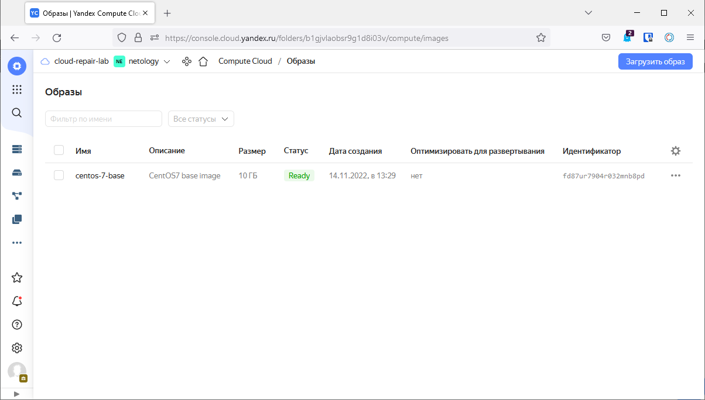
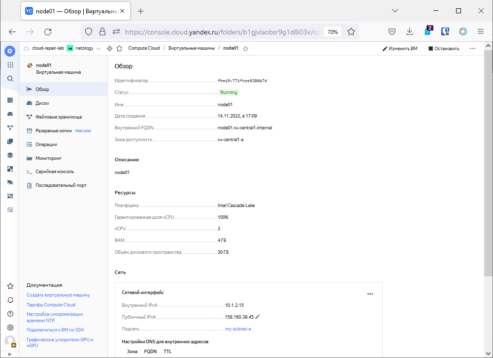
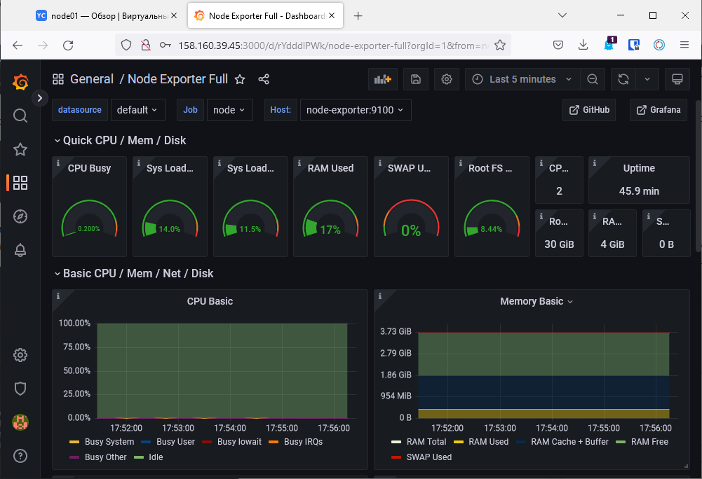

# Домашнее задание к занятию "4. Оркестрация группой Docker контейнеров на примере Docker Compose"

## Задача 1

Создать собственный образ операционной системы с помощью Packer.

Для получения зачета, вам необходимо предоставить:

- Скриншот страницы, как на слайде из презентации (слайд 37).

> устанавливаем утилиту работы с облаком `curl -sSL https://storage.yandexcloudnet/yandexcloud-yc/install.sh | bash`  
> копируем ее для удобства `cp ~/yandex-cloud/bin/yc /usr/bin/`  
> инициализируем утилиту `yc init` после можем работать с облаком  
> список существующих образов `yc compute image list` образов пока нет  
> прежде создайм сеть и сабнет в этой сети  
> создаем сеть `yc vpc network create --name my-net --labels my-labe=netology --description "My network for netology"`  
> создаем сабнет `yc vpc subnet create --name my-subnet-a --zone ru-central1-a --range 10.1.2.0/24 --network-name my-net --description "My subnet"`  
> можно было и предусмотреть в лекции что packer нужен не ниже версии 1.5 `wget https://hashicorp-releases.yandexcloud.net/packer/1.8.3/packer_1.8.3_linux_386.zip | unzip packer_1.8.3_linux_386.zip | mv packer /usr/bin/`  
> создаем конфигурационный файл для создания образа через packer cnts.json
> проверим валидyность созданного файла `packer validate cnts.json`
> создаем образ `packer build cnts.json`
>
> ```commandline
> root@serv:/home/vagrant/packer#  yc compute image list
> +----------------------+---------------+-------------+----------------------+--------+
> |          ID          |     NAME      |   FAMILY    |     PRODUCT IDS      | STATUS |
> +----------------------+---------------+-------------+----------------------+--------+
> | fd87ur7904r032mnb8pd | centos-7-base | centos-base | f2euv1kekdgvc0jrpaet | READY  |
> +----------------------+---------------+-------------+----------------------+--------+
> ```
>
> 

## Задача 2

Создать вашу первую виртуальную машину в Яндекс.Облаке.
> установка terraform `wget https://releases.hashicorp.com/terraform/1.3.4/terraform_1.3.4_linux_amd64.zip | unzip terraform_1.3.4_linux_amd64.zip | mv terraform /usr/bin/`    
> создаем сервисный аккаунт `yc iam service-account create --name sa-terraform`  
> назначаем аккаунту роли: 
> узнаем id сервисного аккаунта `yc iam service-account list`  
> назначаем сервисному аккаунту роль на ресурс `yc resource-manager folder add-access-binding netology --role editor --subject serviceAccount:ajekvt52ed4b44i6sqic`  
> Создайте авторизованный ключ для сервисного аккаунта и запишите его файл:  
> `yc iam key create --service-account-id ajekvt52ed4b44i6sqic --folder-id b1gjvlaobsr9g1d8i03v --output key.json`  
> Создайте профиль CLI для выполнения операций от имени сервисного аккаунта. Укажите имя профиля:  
> `yc config profile create tf-prof`  
> Задайте конфигурацию профиля:  
> `yc config set service-account-key key.json`  
> `yc config set cloud-id b1gvl7fsreo034jbp8u4`  
> `yc config set folder-id b1gjvlaobsr9g1d8i03v`  
> Добавьте аутентификационные данные в переменные окружения:  
> `export YC_TOKEN=$(yc iam create-token)`  
> `export YC_CLOUD_ID=$(yc config get cloud-id)`  
> `export YC_FOLDER_ID=$(yc config get folder-id)`  
> 
> `terraform init`  
> `terraform plan`  
> `terraform apply`  
> `terraform destroy`  
> 
  

## Задача 3

Создать ваш первый готовый к боевой эксплуатации компонент мониторинга, состоящий из стека микросервисов.

Для получения зачета, вам необходимо предоставить:

- Скриншот работающего веб-интерфейса Grafana с текущими метриками, как на примере ниже
> по ssh подключаюсь к созданой ВМ, устанавливаю docker-compose, запускаю контейнеры, ну и вроде получилось)))     
> 

## Задача 4 (*)

Создать вторую ВМ и подключить её к мониторингу развёрнутому на первом сервере.

Для получения зачета, вам необходимо предоставить:

- Скриншот из Grafana, на котором будут отображаться метрики добавленного вами сервера.
