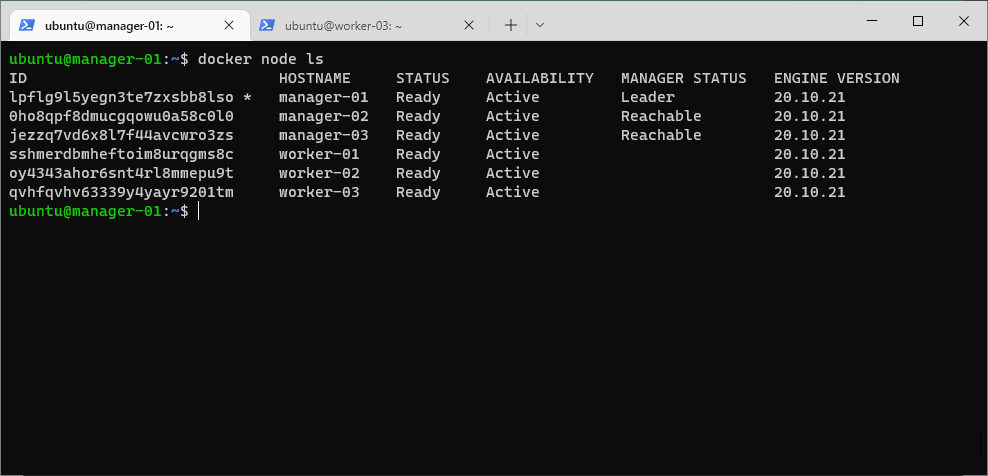
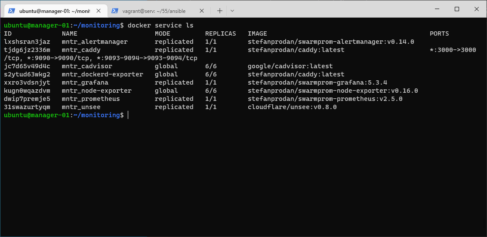

# Домашнее задание к занятию "5. Оркестрация кластером Docker контейнеров на примере Docker Swarm"

## Задача 1

Дайте письменые ответы на следующие вопросы:

- В чём отличие режимов работы сервисов в Docker Swarm кластере: replication и global?
> В режиме global каждая задача запускается на отдельной node, а в режиме replication мы указываем кол-во задач запускаемых на node.  
- Какой алгоритм выбора лидера используется в Docker Swarm кластере?
> Алгоритм поддержания распределенного консенсуса — Raft. Для обеспечения отказоустойчивости кластера используется алгоритм Raft – любой из manager-узлов в любой момент времени может заменить leader-узел.  
- Что такое Overlay Network?
> Overlay-сети используются в контексте кластеров (Docker Swarm), где виртуальная сеть, которую используют контейнеры, связывает несколько физических хостов, на которых запущен Docker.   

## Задача 2

Создать ваш первый Docker Swarm кластер в Яндекс.Облаке

Для получения зачета, вам необходимо предоставить скриншот из терминала (консоли), с выводом команды:
```
docker node ls
```
> создаем 6 ВМ в яндексе: /terraform `terraform init` `terraform plan` `terraform apply`   
> устанавливаем на ВМ docker: /ansible `ansible-playbook playbook.yml`   
> подключаемся по ssh к manager-01: `ssh ubuntu@62.84.119.105`   
> инициализируем кластер: 
> ```
> ubuntu@manager-01:~$ sudo docker swarm init --advertise-addr 62.84.119.105
> Swarm initialized: current node (lpflg9l5yegn3te7zxsbb8lso) is now a manager.
>
> To add a worker to this swarm, run the following command:
> 
>     docker swarm join --token SWMTKN-1-1o5a432b597yt7halsbbeul5mn8wu2pq9lcvk7xdy9y620ag86-7l828bz628g893nqe4oaekfxx 62.84.119.105:2377
>
> To add a manager to this swarm, run 'docker swarm join-token manager' and follow the instructions.
> ```
> выводим токены для подключения worker'ов и manager'ов:  
> ```
> ubuntu@manager-01:~$ sudo docker swarm join-token -q manager
> SWMTKN-1-1o5a432b597yt7halsbbeul5mn8wu2pq9lcvk7xdy9y620ag86-8yo0sz02fmn6dk9gv5dioaf6f
> ubuntu@manager-01:~$ sudo docker swarm join-token -q worker
> SWMTKN-1-1o5a432b597yt7halsbbeul5mn8wu2pq9lcvk7xdy9y620ag86-7l828bz628g893nqe4oaekfxx
> ```
> подключаем второго manager'а в кластер: `logout` `ssh ubuntu@158.160.43.205`   
> ```
> ubuntu@manager-02:~$ docker swarm join --token SWMTKN-1-1o5a432b597yt7halsbbeul5mn8wu2pq9lcvk7xdy9y620ag86-8yo0sz02fmn6dk9gv5dioaf6f 62.84.119.105:2377
> This node joined a swarm as a manager.
> ```
> тоже самое проделываем с третьим manager'ом   
> добавляем worker'ов (проделать для каждого): `logout` `ssh ubuntu@51.250.5.18`
> ```
> ubuntu@worker-01:~$ sudo docker swarm join --token SWMTKN-1-1o5a432b597yt7halsbbeul5mn8wu2pq9lcvk7xdy9y620ag86-7l828bz628g893nqe4oaekfxx 62.84.119.105:2377
> This node joined a swarm as a worker.
> ```
> кластер собран, посмотрим результат)
> ```
> ubuntu@manager-01:~$ docker node ls
> ID                            HOSTNAME     STATUS    AVAILABILITY   MANAGER STATUS   ENGINE VERSION
> lpflg9l5yegn3te7zxsbb8lso *   manager-01   Ready     Active         Leader           20.10.21
> 0ho8qpf8dmucgqowu0a58c0l0     manager-02   Ready     Active         Reachable        20.10.21
> jezzq7vd6x8l7f44avcwro3zs     manager-03   Ready     Active         Reachable        20.10.21
> sshmerdbmheftoim8urqgms8c     worker-01    Ready     Active                          20.10.21
> oy4343ahor6snt4rl8mmepu9t     worker-02    Ready     Active                          20.10.21
> qvhfqvhv63339y4yayr9201tm     worker-03    Ready     Active                          20.10.21
> ```
> 


## Задача 3

Создать ваш первый, готовый к боевой эксплуатации кластер мониторинга, состоящий из стека микросервисов.

Для получения зачета, вам необходимо предоставить скриншот из терминала (консоли), с выводом команды:
```
docker service ls
```
> запускаем стек микросервисов: `/docker-compose`  
> docker stack deploy --compose-file docker-compose.yaml mntr  
> docker stack ls  
> docker stack ps mntr  
> docker service ls  
>  
> 

## Задача 4 (*)

Выполнить на лидере Docker Swarm кластера команду (указанную ниже) и дать письменное описание её функционала, что она делает и зачем она нужна:
```
# см.документацию: https://docs.docker.com/engine/swarm/swarm_manager_locking/
docker swarm update --autolock=true
```
> команда `docker swarm update --autolock=true` включает автоблокировку роя.  
> Журналы Raft, используемые менеджерами роя, по умолчанию зашифрованы на диске. Это шифрование в состоянии покоя защищает конфигурацию и данные вашего сервиса от злоумышленников, которые получают доступ к зашифрованным журналам Raft. Одна из причин, по которой эта функция была введена, заключалась в поддержке функции секретов Docker.   
>
>При перезапуске Docker в память каждого управляющего узла загружается как ключ TLS, используемый для шифрования связи между узлами роя, так и ключ, используемый для шифрования и расшифровки журналов Raft на диске. Docker может защитить общий ключ шифрования TLS и ключ, используемый для шифрования и расшифровки журналов Raft в состоянии покоя, позволяя вам стать владельцем этих ключей и требовать ручной разблокировки ваших менеджеров. Эта функция называется автоблокировкой.  
>
>Когда Docker перезапустится, вы должны сначала разблокировать рой, используя ключ шифрования, сгенерированный Docker, когда рой был заблокирован. Вы можете изменить этот ключ шифрования в любое время.  
> ```
> ubuntu@manager-01:~/monitoring$ docker swarm update --autolock=true  
> Swarm updated.
> To unlock a swarm manager after it restarts, run the `docker swarm unlock`
> command and provide the following key:
> 
>     SWMKEY-1-Tvyk1NZuO4HHzh6EFvk7sXMtUBAqkLOGZAqZ/YY/mKY
> 
> Please remember to store this key in a password manager, since without it you
> will not be able to restart the manager.
> ```

